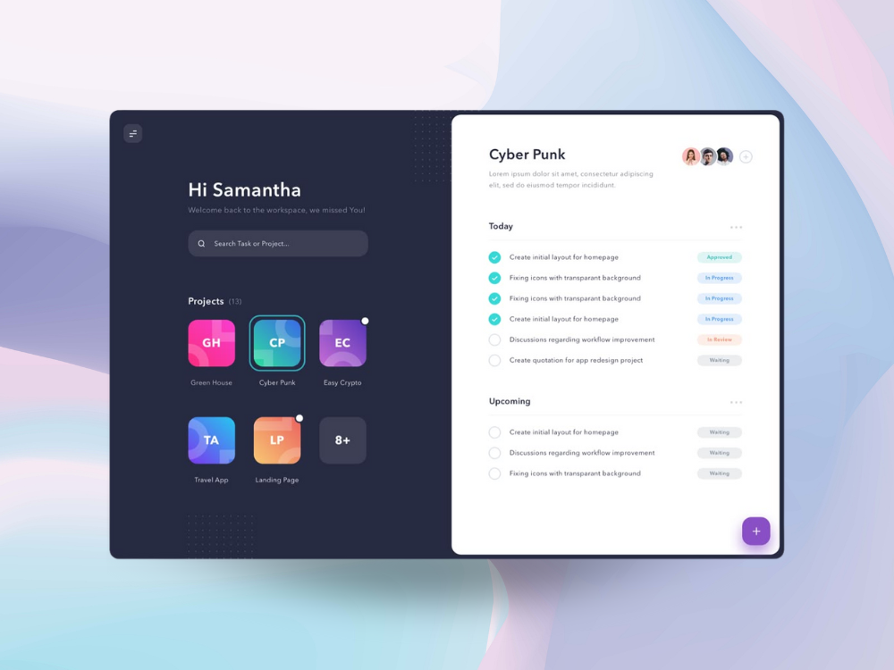

# FrEDie Desktop

FrEDie Desktop is a cross-platform desktop application designed to bring a **floating widget + AI agent experience** directly to your computer.  
It enables seamless interaction with FrEDie through a **persistent widget**, animated input bar, and toast-style notifications, all packaged in a modern Electron + Vite + React stack.

---

<p align="center">
  
</p>


> [!WARNING]  
> This project is currently in **alpha** and under active development. 🛠️  
> Expect frequent updates and potential changes as we refine the application.

---


**Note:**  
The app can run fully offline, by now, if the Pop Up is closed, it may not appear again until reloaded the app.

---

## ✨ Features

- **Floating Widget:**  
  Always-on-top widget that can be dragged anywhere, with animated states (`idle`, `active`, `thinking`).  

- **Expandable Input Bar:**  
  Click the widget to expand a modern input bar (text + file support) and send queries.  

- **Toast Notifications:**  
  Beautiful corner pop-ups appear while queries are being processed.  

- **Cross-Platform Support:**  
  Works on Windows, macOS, and Linux.  

- **Offline-Friendly:**  
  After setup, the widget and toast experience work without constant internet dependency.  

- **Electron + Vite + React:**  
  Fast development, hot reload, and a modern frontend stack.  

---

##  Project Setup

### Install
```bash
npm install
```
### Run
```bash
npm run dev
